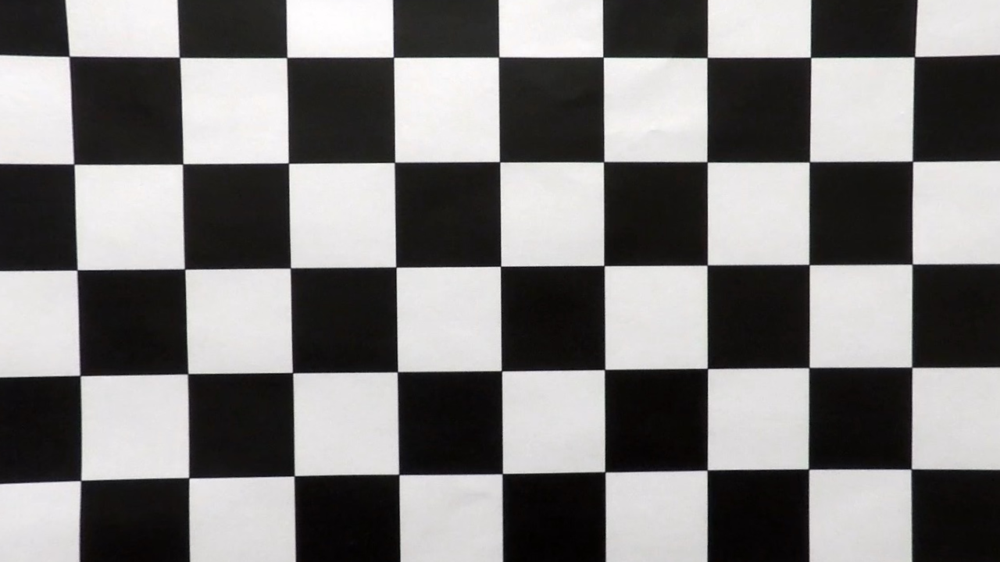
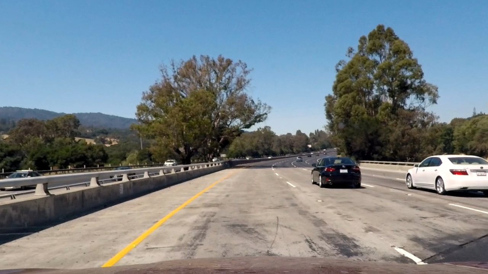
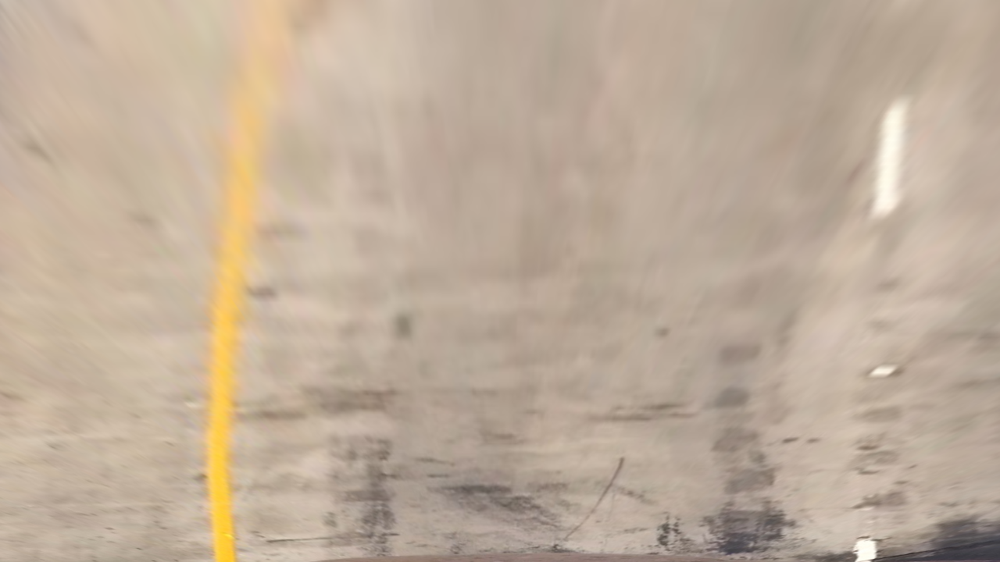
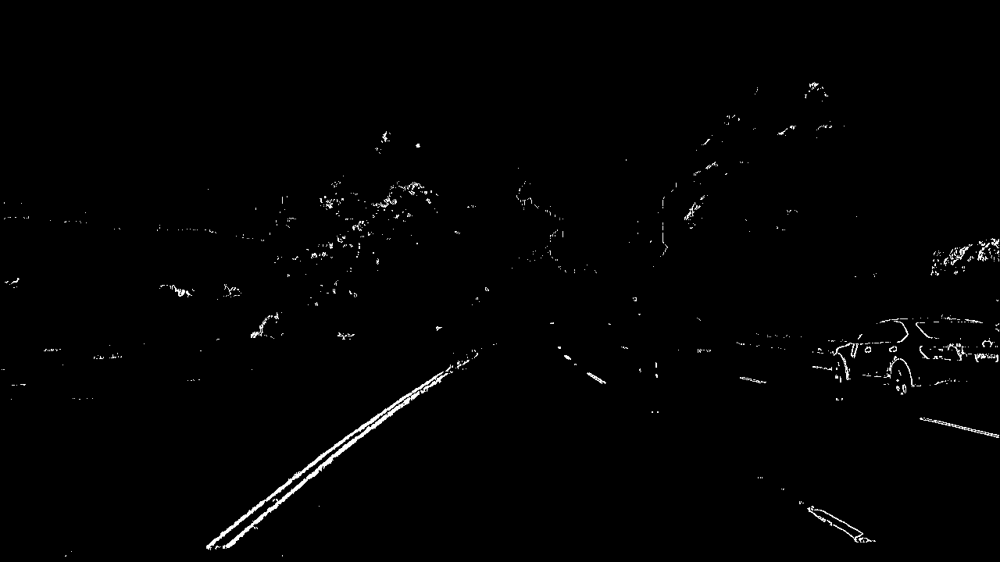
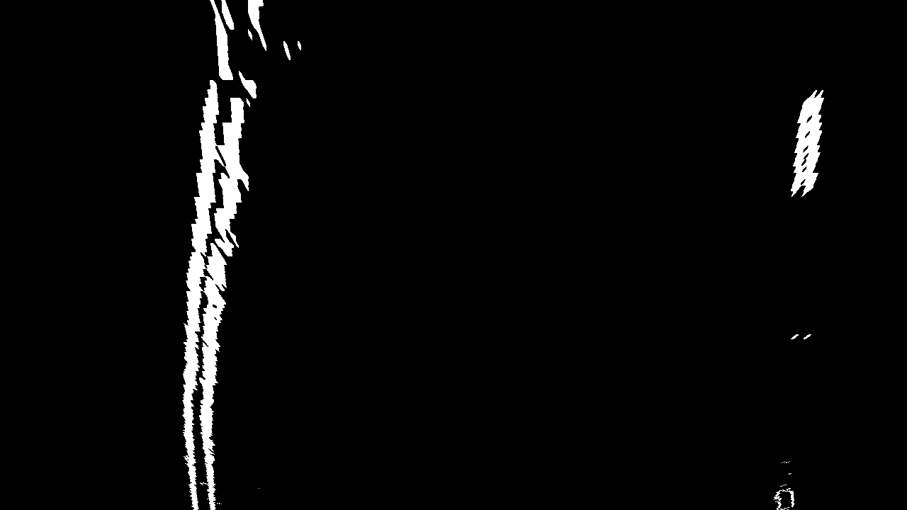

** Project 3: Advanced Lane Finding **

The goals / steps of this project are the following:

- Compute the camera calibration matrix and distortion coefficients given a set of chessboard images.
- Apply a distortion correction to raw images.
- Use color transforms, gradients, etc., to create a thresholded binary image.
- Apply a perspective transform to rectify binary image ("birds-eye view").
- Detect lane pixels and fit to find the lane boundary.
- Determine the curvature of the lane and vehicle position with respect to center.
- Warp the detected lane boundaries back onto the original image.
- Output visual display of the lane boundaries and numerical estimation of lane curvature and vehicle position.

** Camera Calibration **

Camera calibration is implemented in module camera.py. Code is organized in next classes:
- CameraCalibrationSet - class that provides access ability to enumerate chessboard images
- Camera - class that handles load of calibration set, calibration of the camera for given image size and Undistort function   

Main idea of camera calibration using chessboard pattern is to establish relations between so called objects in 3D space with 2D coordinates on captured images. For chessboard objects are corners established by white-black areas. Since chessboard is flat it is easy to assume that Z coordinate is constant.

Calibration of distortion done by cv2.calibrateCamera function

Original:
  

Undistorted:
  

** Pipeline **

Entry point to the script is start.py. There are 2 options to load data from. It either static test images or video clip. ProcessTestImage function demonstrate implementation of the image processing pipeline. ProcessVideoClip implements videoclip processing, but generally uses same image processing Pipeline

*** Step 1. Load image ***

Based on source of image it can be loaded by matplotlib.image.imload function (or one of the alternative) or combination of:
```python
clip = VideoFileClip(filename, audio=False)
original = clip.make_frame(0)
```

parameter audio=False was essential for me, due to the issue with moviepy, it crashed when I tried to read clip unless audio stream was disabled.


*** Step 2. Remove distortion ***

Since calibration procedure for the camera was already  specified, calling Undistort function was now a big deal. Most significant changes are visible on the border of image. The content in the center is not significantly modified.



*** Step 3. Bird View ***

There are 2 classes that implement bird view modification defined in camera.py: ViewPointBuilder and ViewPoint. It is typical implementation of Builder pattern when there is a need to construct complex object. So ViewPointBuilder provides methods that alloys to specify trapezoid shape that will be stretched to parallelogram and enable inverse transformation.  



*** Step 4. Thresholded binary image ***

[RGB]->[HSV]->[S channel]->[X Sobel] and
([RGB]->[HSV]->[In Range White] or [RGB]->[HSV]->[In Range Yellow])

Method of point extraction were adjusted to given test images and video clip.
1. RGB image converted to HSV space
2. HSV color signal used with combination of ranges to extract yellow and white colored pixels.
3. Signal from  Saturation channel combined with X Sobel operation used to detect contrast vertical lines
4. White and Yellow signal masked by Sobel signal in order to reduce non-vertical noise   

Specific call and combination of thresholds implemented in module start, class ImageProcessing, function Filter



and same image after transformation to bird view


*** Step 5. Fitting ***

Moto of the code that implements line/lane detection/fitting is in line.py module.

- LineLocator class implements high level algorithms of sliding window and lane detection using fit data calculated for previous frame in image


Next classes also defined:
Line - data that belongs to either left or right size of the lane.
Lane - aggregates 2 Line objects and dispatches calls
LineWindow - helper class that implements part of detection by sliding window method
LineAdjuster - helper class that implements part of detection by previously fit data method    

Both methods now mixed into one (basically adjustment will fall back to the sliding window search if there is a significant difference between first coefficients of second order polynomes). This logic is defined in SmartLocate method of LaneLocator class.

*** Step 6. Low Pass Filter ***

In order to remove lane detection jitter, decayed LPF is used. It has better results then averaging. Implementation is in lpf.py module   

***  Step 7. Visualize Lane ***

Lane visualization is 3 step process. First step, left and right lines and area between them are drawn on new empty bird view. It is implemented in Lane class Draw method.

Than, bird-view inverse transformation are used. It is implemented in ApplyLane method of ImageProcessing class (start.py) and in RevertBirdView

And last step is to merge result with original image using cv2.addWeighted


*** Step 7. Curvature Radius and offset ***

To calculate Radius of Curvature I used formula provided in lecture. Yet, I think that approach to convert from pixels to meters, that require generation of fake data is rather strange. I recalculated polynomial coefficients:
  X = Xmeters / meters_per_pixel
  Y = Ymeters / meters_per_pixel

it is implemented in ScaleFit and CalculateRadius methods of Line class

** Video Result **

The clip with result of lane finding is uploaded to YouTube and available by
https://youtu.be/adUubY3suKY

** Discussion **

1. It was fun project.
2. I'm not convinced that it is possible to build static  method of gradient and color thresholding that will work for all conditions. It has to be dynamic and probably learned by neural net
3. Seriously, please fix explanation of conversion from pixels to meters.
4. Seems like curvature radius calculation depends on camera location. It would be nice to make an adjustment.
