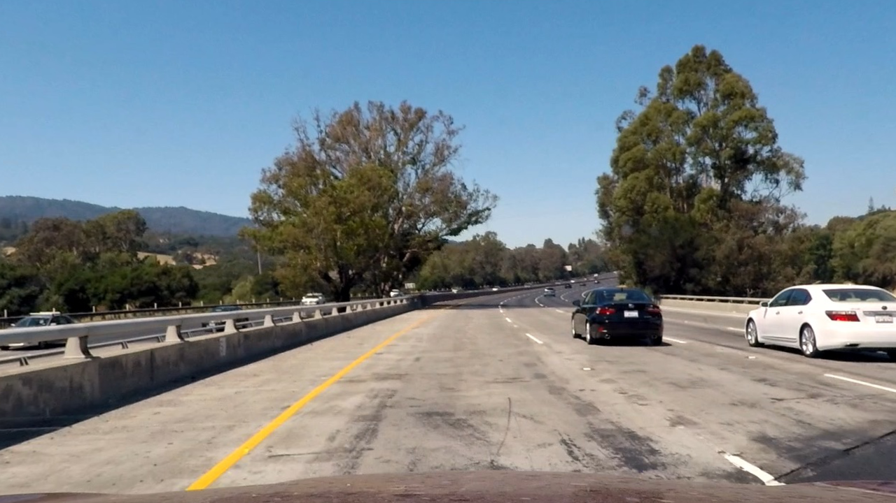
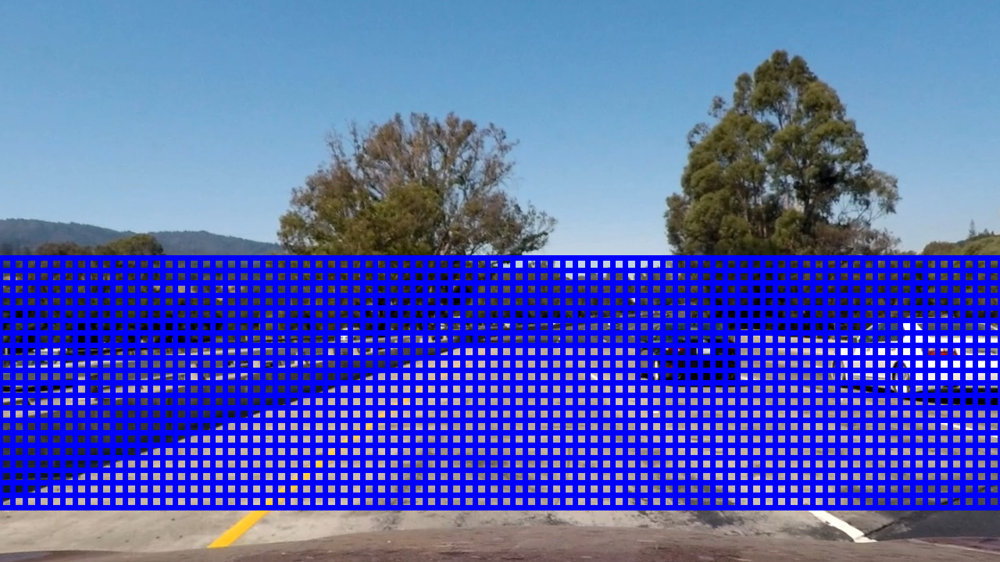
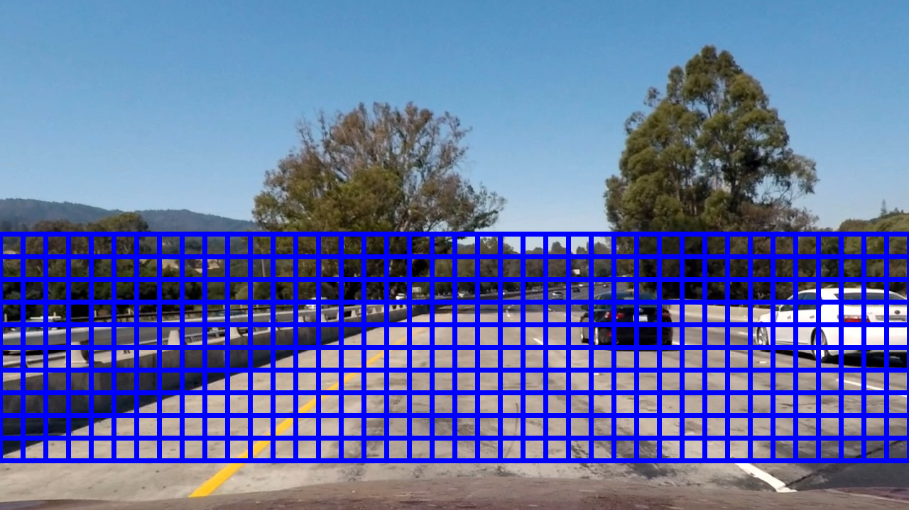
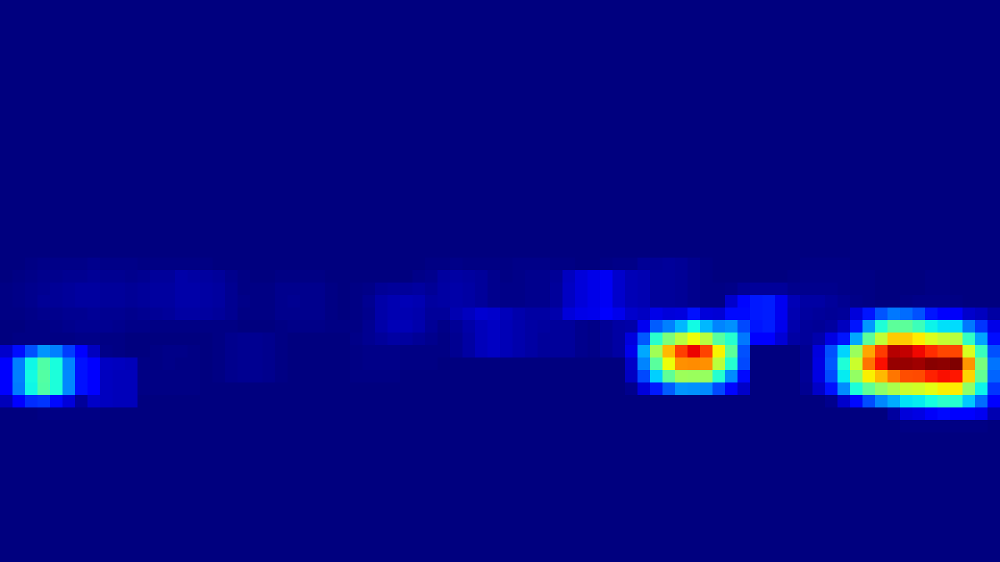
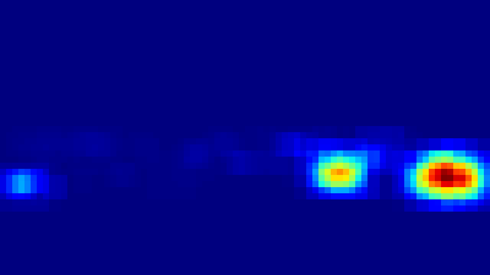
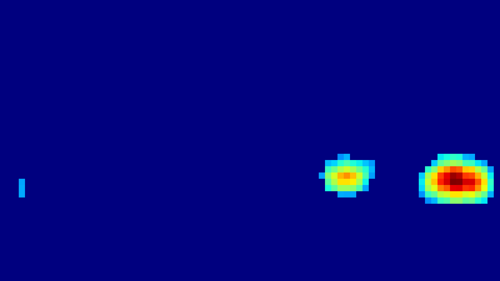
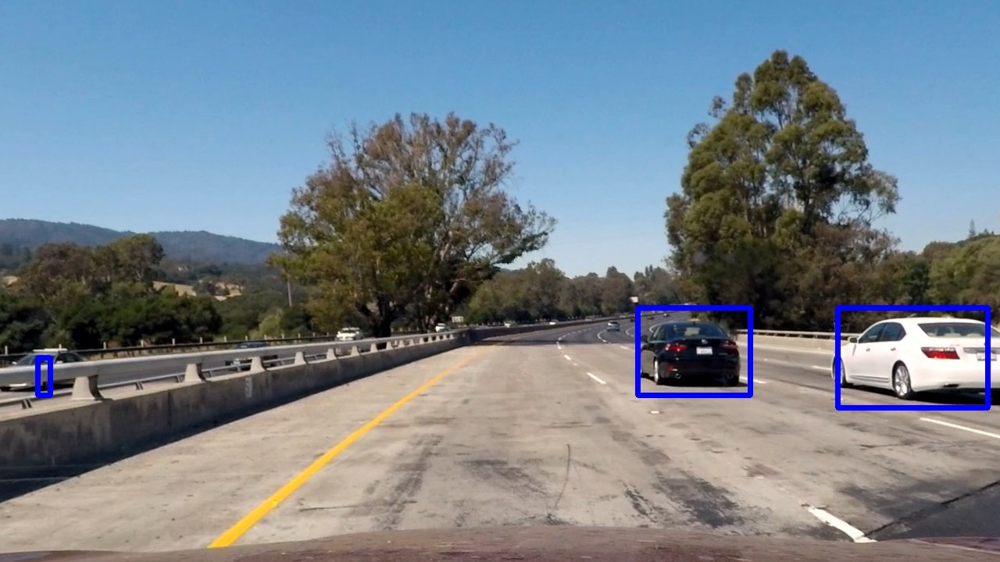

** Vehicle Detection Project **

Goal of this project is to detect vehicles in test images and ultimately in video clip.

Steps that I took to archive goal:
* Train vehicle detector to detect cars on 32x32 images
* Use sliding windows and heat to detect cars of different sizes on 1280x720 image
* Integrate detection into video streaming pipeline
* Tried techniques to track detected cars and remove false positives  

Disclaimer: As stated in rubrics implementation of this project suppose to use HOG and possible other classical CV algorithms, however, as at was stated during Q&A it is OK to use deep learning for this project.  This implementation uses neural network detector. The intuition about math around combination of HOG and SVC with linear kernel is very similar to deep network with couple of convolution and fully connected layers.    

** Detector **

I trained neural network detector on dataset provided with project. It has 8792 car images and 8968 images of not cars. It is balances dataset. As data preparation all images are resized to 32x32. Data was shuffled and split into training, validation and test sets.

After multiple experiments next network architecture was used:
1. Convolution2D with kernel size 3 and stride 2 followed by 0.5 dropout and "relu" activation. Convert 32x32x3 input to 16x16x12 output.
2. Convolution2D with kernel size 3 and stride 2 followed by 0.5 dropout and "relu" activation. Convert 16x16x12 input to 8x8x24 output.
3. 80 neurons fully connected layer followed by 0.5 dropout and "relu" activation.
3. 5 neurons fully connected layer "relu" activation.
5. Output 1 neuron with sigmoid

Model uses binary cross-entropy loss function for loss measurement. Adam optimizer demonstrated best training results.

Training stats:

|Training loss |Training accuracy |Validation loss| Validation accuracy|
|-------|-------|-------|------|
|0.5133 |0.7298 |0.2931 |0.8904|
|0.2934 |0.8832 |0.1820 |0.9396|
|0.2179 |0.9139 |0.1366 |0.9562|
|0.1797 |0.9322 |0.1113 |0.9597|
|0.1581 |0.9409 |0.0998 |0.9668|
|0.1382 |0.9490 |0.0812 |0.9763|
|0.1218 |0.9550 |0.0640 |0.9781|
|0.1147 |0.9595 |0.0616 |0.9805|
|0.1089 |0.9604 |0.0556 |0.9846|
|0.0974 |0.9654 |0.0481 |0.9852|
|0.0963 |0.9644 |0.0622 |0.9781|
|0.0892 |0.9668 |0.0447 |0.9870|
|0.0780 |0.9714 |0.0406 |0.9882|
|0.0774 |0.9720 |0.0461 |0.9870|
|0.0710 |0.9741 |0.0402 |0.9864|
|0.0670 |0.9761 |0.0323 |0.9917|
|0.0666 |0.9747 |0.0390 |0.9893|
|0.0648 |0.9760 |0.0354 |0.9882|
|0.0630 |0.9781 |0.0302 |0.9929|
|0.0610 |0.9785 |0.0284 |0.9917|
|0.0537 |0.9804 |0.0252 |0.9941|
|0.0535 |0.9813 |0.0213 |0.9953|
|0.0539 |0.9812 |0.0226 |0.9947|
|0.0512 |0.9818 |0.0238 |0.9935|
|0.0503 |0.9823 |0.0195 |0.9953|

Test set result:
loss: 0.030708463193412434
acc: 0.9932432432432432

as you can see, test accuracy is close to 100% and no signs of over-fitting

** Sliding Window **

Single page processing implemented in start.py file, class ImageProcessing, function DetectCarsDemo  

     

There are multiple options for sliding windows. After multiple experiments I found that for specific purposes it is better to use large window sizes, but large overlaps. So, I decided not to use 32x32 windows because it brings noise and multiple not connected objects. I slide part of the picture 2 times using 64x64 and 128x128 windows with 75% overlaps:

64
     
128

The parts of images are resized to 32x32 RGB and feed to neural network. Results from detection (signal from sigmoid) are summed as a heat:

64
     
128

For single picture processing, simple threshold is applied:

and as scipy.ndimage.measurements.label() function used to find connected areas and scipy.ndimage.find_objects() used to extract enclosing boxes, see: image_tools.draw_labeled_bboxes() .

** Video Pipeline, Tracking and False positives **

Final video available here: https://youtu.be/fsk3JoJH1wg

It is implemented in file start.py, functions: PrepareDetection and DetectCars

Filtering of false positives. To remove jitter and false positive from video detection, signal is passed through Low Pass Filter. To be specific, thresholded heat is scaled to pseudo binary values (0-no object, 1-car) and this 2d matrix applied with one in memory with cool down parameter. LOPF implemented by lpf.HeatmapSmoother class in lpf.py.

** Discussion and next steps **

For jitter and removal of false positive, I've also tried averaging and signals other then thresholded heat (like raw heat, center of mass and sizes). Unfortunately, I could not find method that satisfies me completely. I think that next possible step is to track individual objects, but it will require introduction of object size, distance from the camera and probably switching from detector to regression to be able to distinguish between small and large vehicles.    
